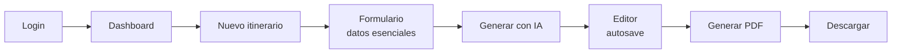
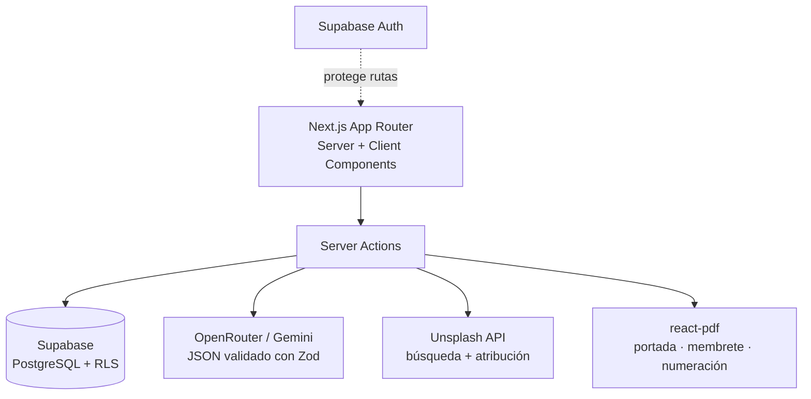

# Travel Itinerary & Proposal Generator


Aplicación web interna que permite a los agentes de una agencia de viajes crear
**itinerarios y propuestas comerciales profesionales en minutos**: el agente captura
solo los datos esenciales del viaje (pasajero, destino, fechas, lugares por día) y
la IA redacta los textos, selecciona imágenes y produce un PDF listo para enviar
al cliente.

> Proyecto real desarrollado para una agencia de viajes. Este repositorio es una
> versión **anonimizada** para portafolio: se sustituyeron el nombre, la identidad
> gráfica y las credenciales del cliente por valores genéricos (`Wander Travel`).
> Ningún dato real de clientes, viajeros ni claves de API está incluido.

## Qué demuestra este proyecto

- Arquitectura full‑stack con **Next.js 16 (App Router)** — Server Components,
  Server Actions y Route Handlers como backend, sin API REST separada.
- Integración de **IA generativa** (OpenRouter / Gemini) con un contrato de salida
  estricto en JSON validado con **Zod**, más un prompt maestro versionado y
  desacoplado del código (`prompts/`).
- **Supabase**: PostgreSQL con migraciones SQL, autenticación y **Row Level
  Security** para aislar los datos de cada agente.
- Generación de **PDF** a medida con `@react-pdf/renderer` (portada, membrete,
  numeración "Página X de Y", fuentes embebidas).
- Búsqueda y atribución de fotografías vía **Unsplash API**, con caché y una
  imagen de respaldo cuando no hay resultados.
- **Autosave** en el editor (debounce + guardado al dejar de escribir) para que
  nunca se pierda contenido.
- Separación estricta `app / components / features / services / hooks / lib /
  types / utils`, TypeScript estricto y validación en cada frontera.

## Stack

| Capa | Tecnología |
|---|---|
| Frontend | Next.js 16, React 19, TypeScript, TailwindCSS 4, shadcn/ui |
| Backend | Next.js Server Actions + Route Handlers |
| Base de datos | Supabase (PostgreSQL, Auth, Storage, RLS) |
| IA | OpenRouter (API compatible con OpenAI) / Google Gemini |
| Imágenes | Unsplash API |
| PDF | `@react-pdf/renderer` |
| Deploy | Vercel |

## Documentación del proyecto

- [`PROJECT_SPEC.md`](./PROJECT_SPEC.md) — especificación funcional (fuente de verdad).
- [`ARCHITECTURE.md`](./ARCHITECTURE.md) — decisiones técnicas y contrato de datos.

## Primeros pasos

```bash
npm install
cp .env.local.example .env.local   # completar con claves propias
npm run dev
```

Abrir <http://localhost:3000>.

Para una ejecución completa se necesita un proyecto de Supabase (aplicar las
migraciones de `supabase/migrations/`), una clave de OpenRouter y una Access Key
de Unsplash. Ver [`.env.local.example`](./.env.local.example).

## Flujo principal



## Arquitectura (alto nivel)



## Estructura

```
app/          Rutas (grupos (app) y (auth)) y route handlers de PDF
components/    UI reutilizable (shadcn/ui + componentes compartidos)
features/      Lógica por dominio: auth, dashboard, editor, itinerary-form,
              proposals, pdf
services/      Clientes externos: supabase, gemini, unsplash
prompts/       Prompts maestros de IA (versionados, fuera del código)
supabase/      Migraciones SQL
types/         Tipos de dominio y de la base de datos
```

## Licencia

[MIT](./LICENSE)
